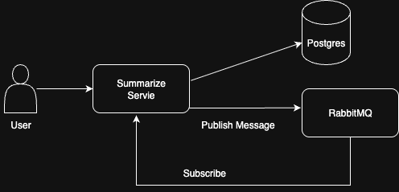
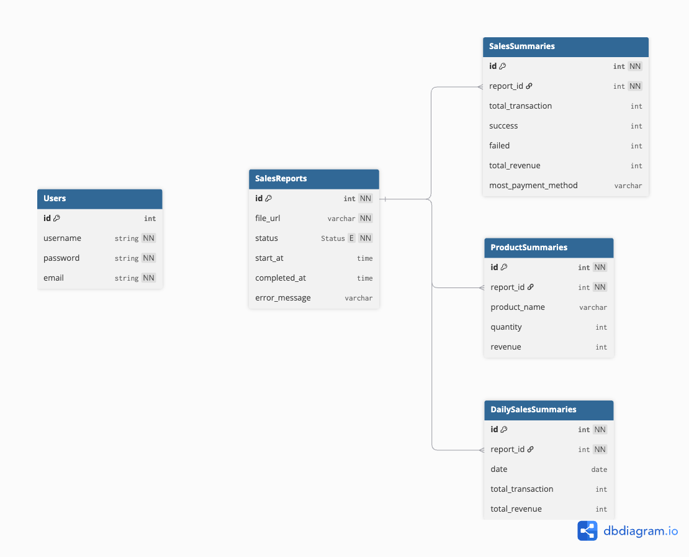

# SalesAn

SalesAn is an service to summarize an sales report file. SalesAn support common file like csv, xslx, and etc.

This is a fun project i used to learn about asynchronous programming and RabbitMQ

## Features

### Sales Report

- Upload a sales report
- Get all summarized file
- Get the summarize of a specify file
- Summarize a file

## Architecture

### Business Logic Layer

- **Usecase**: Contains business logic implementation
- **Domain**: Handles entity operation and data persistence
- **DTO**: Data Transfer Object for API Documentation
- **Entity**: Core domain models

### Software Architecture



### Component Breakdown

- #### Summarize Service
  Handles all operation related to sales report processing
  1. Accept file upload from user and store it into postgreSQL and publish it to RabbitMQ
  2. Generate and store summaries from sales report file
- #### RabbitMQ
  A message broker that triggers the summarize function in the Summarize Service. It enables asynchronous processing and decouples the communication between components
- #### PostgreSQL
  The main persisteance layer for all user data and sales report.

### Database Design



## Development Setup

### Prerequisites

- Go 1.23+
- Docker (for running RabbitMQ and PostgreSQL)

### Set Up Project

Before running the application, you need to set up the project environment. Follow these steps:

copy the default configuration file:

```bash
cp ./etc/cfg/conf.json.example ./etc/cfg/conf.json
```

you can edit the `conf.json` file to set your environment variables, such as database connection strings, RabbitMQ settings, and other configurations. But i recommend you to follow the default settings, which should work out of the box.

Run the docker-compose to start the necessary services (RabbitMQ, PostgreSQL, and Redis):

```bash
cd env
docker-compose up -d
```

After the services are up, you need to initialize the database schema and seed data. Run the following command:

```bash
cd docs/sql
./init.sh
```

Finally, you can run the application.

### Running the Application

For run the application, you need to install the Swagger tool and generate the API documentation. Run the following commands:

```bash
make swag-install
```

Make sure the installation is correct by running:

```bash
make swaggo
```

After that, you can start the application by running:

```bash
make run
```

This will start the application, and you can access the Swagger documentation at

- `http://localhost:8080/swagger/index.html`

### Register a New User

To begin using the system, register a new user by sending a POST request to:

```
POST http://localhost:8080/auth/v1/register
```

**New Body(JSON)**

```
{
    "name": "your-name",
    "email": "your-email",
    "password": "your-password",
    "confirmPassword": "your-password"
}
```
